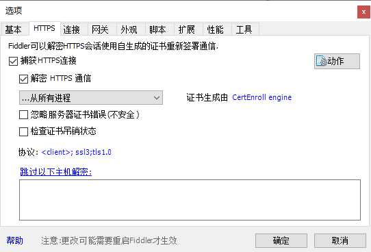
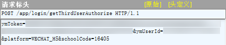
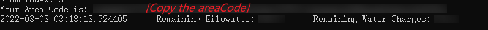
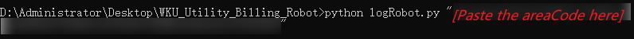
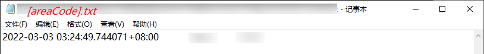
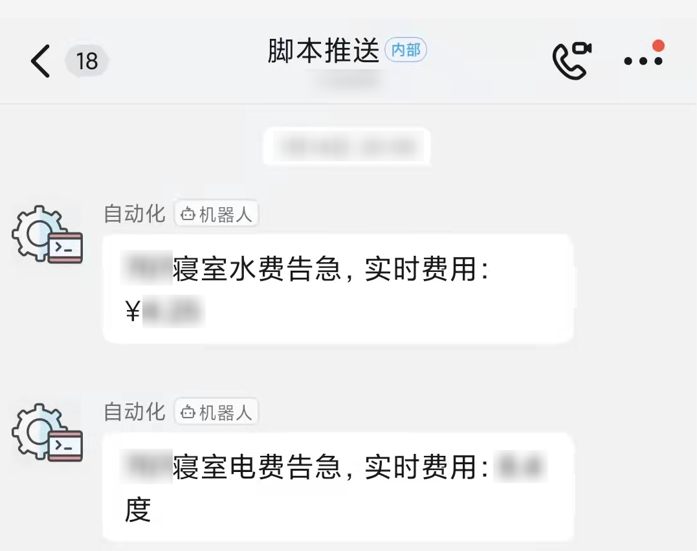

# WKU_Utility_Billing_Robot
Used to record WKU's utility bills on a regular basis. 

[在寻找中文版的Readme？](README.md)

## Background

Because the utility billing system on WKU's campus is occasionally late in deducting charges, and the back charges lack convincing proof. Many students are puzzled by the charges, but have no basis for complaint. To get a better handle on utility usage and leave first-hand evidence, I open-sourced this automated script. Combined with a timed task, it automatically queries the current remaining utility bills and creates a record based on a set interval of time.

## Installation

### Step#1: Capture the Required Validation Data

In the process of obtaining utility bill data, cookie are necessary for authentication process. To catch the packets, I start from the card recharge service under the WeChat official account "Wenzhou-Kean University Campus Card".

> Tip: In this tutorial, I use Fiddler as the packet capture software.

#### Step#1.1: Enable the Capture of HTTPS Traffic

Since the parameters we need to get the cookie are communicated via HTTPS, we must make sure that the packet capture software has enabled this feature before we start.



#### Step#1.2: Crawl HTTPS requests from the WeChat Official Account

After the packet capture software start capturing packets, we navigate to the WeChat, open the official account and click on "Campus Services", "Card Recharge Service", and "Water Bill Payment" in order.

#### Step#1.3: Obtain the Validation Data

Final step! Navigate to the packet capture software and find the request with header "POST /app/login/getThirdUserAuthorize HTTP/1.1". Copy the *ymToken* and *ymUserId* in the text view to fill in the script.



> Tip: If the text contains special symbols, you need to convert it into ASCII Code. For example, "=" needs to be converted to "%3D".


### Step#2: Install the Script Dependencies

This project uses Python3 and some dependency packages, make sure you have them installed.

```sh
pip install -r requirements.txt
```


### Step#3: Get the Area Code of Your Dormitory

#### Step#3.1: Fill in the Validation Data

Paste the validation data(*ymToken* and *ymUserId*) you got in the Step#1 into both scripts.


#### Step#3.2: Execute firstRun.py

In the firstRun script, you need to follow the prompts to select the building, floor and dorm number in turn.

```sh
python firstRun.py
```

#### Step#3.3: Get the areaCode

Copy the *areaCode* provided by the script for later deployment of the logging robot.



> Tip: If the displayed utility bills are not the same as the App side, please let me know via Issues!


### Step#4: Deploy the Logging Robot

#### Step#4.1: Execute logRobot.py with Specific areaCode

```sh
python logRobot.py "your_area_code"
```


> Tip: The *areaCode* parameter needs to be enclosed in quotation marks, otherwise the script will raise an error!

After the execution, a txt file with the name *areaCode* is generated in the current directory. The time and the corresponding utilities are recorded in it.




#### Step#4.2: Deploy the Robot Wherever You Want

The script is currently deployed on my private NAS and is logged regularly via crontab. Here is the crontab task I have set up:
```sh
0 */4 * * * cd /data/fee && /usr/bin/python3 logRobot.py [areaCode]
```


## Extensions

The script can be lightly improved to enable utility bill alert function via Dingding. The code will (probably) be released later.


